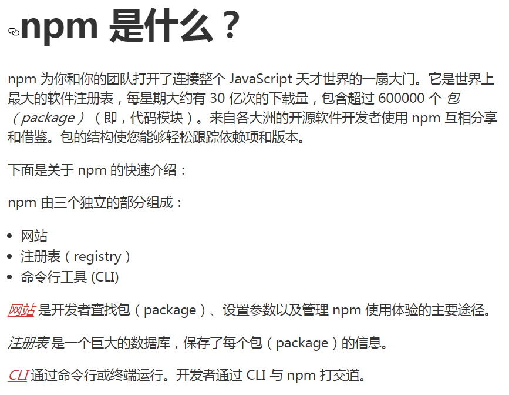

## 个人介绍
> 蔡海，男，未婚，辽宁科技学院，电气工程及其自动化专业，贵州省贵阳市息烽县
## 工作经验
+ 2017-7——2018-1    贵州华信智原科技有限公司（学徒）
+ 2018-1——2018-11   贵州华信智原科技有限公司（前端网建）
+ 2019-1——2019-4    贵州阳光水木科技有限公司（前端开发）

## 分享内容
### export与import(ES6 module模快)

1. 定义：
    > 他就是javascript在es6这个版本实现的一个概念，目的是将js模块化，让js模块（文件）之间可以互相引用。

2. 基本特点：
    + 每一个模块只加载一次， 每一个JS只执行一次， 如果下次再去加载同目录下同文件，直接从内存中读取。 一个模块就是一个单例，或者说就是一个对象；
    + 每一个模块内声明的变量都是局部变量， 不会污染全局作用域；
    + 模块内部的变量或者函数可以通过export导出；
    + 一个模块可以导入别的模块

3. 基本语法：
    通过export导出
    ```
        // uitl.js
        function a(){
            console.log('执行了函数a')
        }
        function b(){
            console.log('执行了函数a')
        }
        var c = '蔡海';
        console.log(this);
        export {a,b,c}
    ```
    通过import导入
    ```
        // main.js
        import {a} from './uitl.js'
        a();
    ```
    或者
    ```
        // uitl.js
        function a(){
            console.log('执行了函数a')
        }
        function b(){
            console.log('执行了函数a')
        }
        var c = '蔡海';
        export default {
            a,b
        }
    ```
    ```
        // main.js
        import uitl from './uitl.js'
        uitl.a();
        uitl.b();
    ```
    又或者
    ```
        // uitl.js
        import Vue from 'https://cdn.jsdelivr.net/npm/vue@2.6.10/dist/vue.esm.browser.js'
        function a(){
            console.log('执行了函数a')
        }
        Vue.filter('capitalize', function (value) {
            
        })
    ```
    ```
        // main.js
        import './uitl.js'
    ```
4. 实例：
    > 看module.html
5. 目前的使用状况
    > 兼容性不太好，IE不支持，很多工具库也没有提供这种原生module的js文件

### vue-cli（Vue.js 开发的标准工具）

1. vue开发的标准工具，可以用它在node环境下搭建一个基于webpack的vue项目。
    1. 安装nodejs及npm
        + nodejs是一个基于 Chrome V8 引擎的 JavaScript 运行环境
        + 我觉得简单的理解它就是一个模块仓库，然后我们可以通过命令行下载
        + 去nodejs官网下载安装，安装nodejs时，会自动安装npm
    2. 通过npm安装vue-cli
    `npm install -g @vue/cli`
    3. 用脚手架创建项目
    `vue create hello-world`
    4. 运行
    `npm run serve`
    5. 打包
    `npm run build`
2. 项目结构分析
